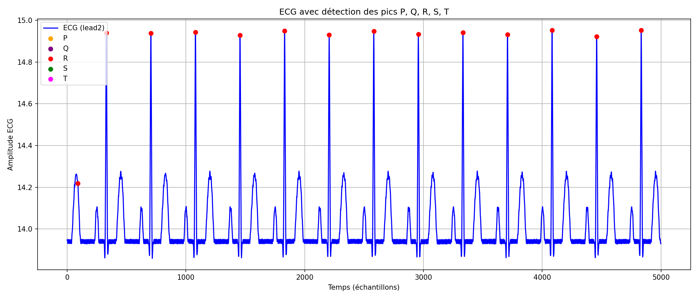

# Lab 01 — Analyse ECG

## Dépendances

```bash
sudo apt install libmatio-dev
pip install matplotlib pandas
```

---

## Build

```bash
mkdir -p build && cd build
cmake ..
make
```

---

## Lancer l'analyse

```bash
# Depuis lab01/build/
./ecg_dealination ../80bpm0.csv output.json
```

---

## Générer le graphique

```bash
# Depuis lab01/
python3 scripts/visualize_ecg.py \
  --csv 80bpm0.csv \
  --json output.json \
  --lead lead2
```

L'image est sauvegardée dans `lab01/ecg_plot.png`.

---

## Résultat


